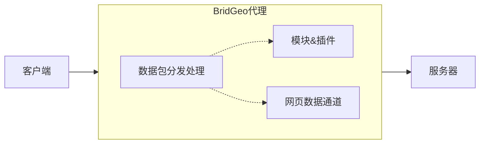

<!--suppress CssUnusedSymbol -->
<style>
@media screen and (min-width: 76.25em) {
    .md-header--lifted~.md-container .md-sidebar--primary {
        display: none;
    }
    .md-main__inner {
        padding-left: 8em;
        padding-right: 8em;
    }
}
</style>

![brid-geo](https://socialify.git.ci/Cdm2883/brid-geo/image?description=1&font=Jost&forks=1&issues=1&logo=data%3Aimage%2Fpng%3Bbase64%2CiVBORw0KGgoAAAANSUhEUgAAALQAAACWCAYAAAB3qaIPAAAAAXNSR0IArs4c6QAABCxJREFUeJzt3U1rXGUYx%2BGZdrQGRK3iIiTW%2BlaNdaGU2GYhiPgJ%2FBguRN0ILly4y0KRLlyKS0EQBFEE3bipGhRfsNEWsVYLVpv4UiFaWuO2OKdyN%2BckZ%2FLvdS0Pd86cSX485GHmzAwHsAnW19cbDzccG1bONxyWxgY7SlOwTQiaKIImiqCJUvtPG%2F7HJTaAjaPFuQ1vFK3QRBE0UQRNFEETZdT3BRChvCtscb7SRtEKTRRBE0XQRBE0UWwK6UL1FedOXylsYoUmiqCJImiiCJooNoW01vQ2zst4S2mnb2G2QhNF0EQRNFEETRSbQrZSm1cUvX2UK4%2BgiSJoogiaKBO1Kdw%2FO9XpvWknZ9dKc2cfqZ3vj8dfLc09%2Btih0tz0%2BYdLc7%2BunSvN7Z66upfzvfnpT21e7dvw37zp1UgrNFEETRRBE0XQRJmoTSHx2mz6Sz9rhSaKoIkiaKIImigTtSm88E9tz7BzR8ffpHG8Nvbd96dLc1NTt9dOeLY2ds1oZ%2B1xi3%2FNteL5NkHTH67TD5%2BxQhNF0EQRNFEETZSJ2hSS4zI%2BfGbDG0XfU0g8QRNF0EQRNFEmalPY%2BSuFv9fGPn9hsTT3xLNPleZWVt4uzd1Qu2UvRtMm7lKjG30MKzRRBE0UQRNF0EQRNFEETRRBE0XQRBE0UTq%2BOa%2Bd6qeP%2FnXuQul81%2B6q3Ts3N319aW51rfa4f66dL81NutFVtTw%2BWF6dmI6s0EQRNFEETRRBE0XQRBE0UQRNFEETRdBEmah7CqsOPHBrae6boz9u8pU0u%2Fm6XaW56qeFVp1c%2Fbs0t%2BfG2vVtR1ZoogiaKIImiqCJImiiCJoogiaKoIkiaKIMXz78SpsvFL%2Fi3XnfbX1fAhexQhNF0EQRNFEETRRBE0XQRBE0UQRNFEETZXTmzC%2BdnvDUqdp9fDMzsxHnu%2Bm33aW5H06cKM3dsnev87VghSaKoIkiaKIImiiCJoqgiSJoogiaKIImyvD55xbdU9jC3ffv6%2FsSuIgVmiiCJoqgiSJoogiaKIImiqCJImiiCJoo5W%2FKW17%2BqjQ3N7c%2F4nx9WfrwSGlu%2FtCC8zWwQhNF0EQRNFEETRRBE0XQRBE0UQRNFEETxT2FLbmncLJYoYkiaKIImiiCJoqgiSJoogiaKIImiqCJUr6nkHZeWnyx0%2FM9%2BczTnZ6va309Xys0UQRNFEETRdBEsSncItN7Zvq%2BhC3V1%2FO1QhNF0EQRNFEETZTRYDAY%2Fvfg8W%2BPjQ1%2B9MmRXu49PHhgYez67rqjn%2Fv4fl45PXbsncW3Sr%2BXrjdJSx8vjf1e5h%2Bc7%2FQxvvzsi7Fj77%2F73kQ%2FXys0UQRNFEETRdBEGftHezAYDPbdc2%2FT4b4%2BkGbsGo99fbSP6xgsHHyo6XAvm6RBw%2B%2Fljddf6%2FQBtuPztUITRdBEETRRBE2UfwHB4LTs4CObsQAAAABJRU5ErkJggg%3D%3D&name=1&owner=1&pattern=Circuit%20Board&pulls=1&stargazers=1&theme=Auto)
# BridGeo <small>*(aka. BGO)*</small>
<p style="margin-top:-32px"></p>

[


](https://github.com/Cdm2883/brid-geo/releases/latest)
[![QQ Group](https://img.shields.io/badge/QQ_Group-Cdm's_group-0099ff?style=for-the-badge&logo=data%3Aimage%2Fpng%3Bbase64%2CiVBORw0KGgoAAAANSUhEUgAAAGAAAABgCAYAAADimHc4AAAACXBIWXMAACE4AAAhOAFFljFgAAAAAXNSR0IArs4c6QAAAARnQU1BAACxjwv8YQUAAARcSURBVHgB7Z2NUdswFMf%2F6XWAdALEBNAJaiZomQAzQekEJBOUTsAIzQawQekEdicgnUDVO8uHa0icSHqyJb%2Ffnc6Q5GxLT%2B9DlvwECIIgCIIgzJEFJo7WujCHc1PO7HFpiur9rDZla4%2B%2FTXky5XGxWGwhHA81uin3pjxrPx5MKU1ZQhjGNlalw1OZcmuKgvAa3fT4J81PZUoJ4QXTIN91fB703LXBNMDSNsRYVHoCQhglCrIVf8DraCY2FCVdmGjpCSMRXQC6iUh%2BYfzGbxlVCO8Qn3tMp%2FEJ6hA%2FxzJHUQVgKnlrDl8wPRSajpEv1MP09FkhMtF8gKlchWmZnl2cGn9QIxJRTJBuBj8KaRDVFEXRgIR6fwtFRY%2BIALsGJNb7W24RCXYNSLD3t0TRAlYNMI1PIadCmkQJl7lN0BRj%2FkO50hHmEdhMkL35Z6QNuxni1IAC6cOuwZwCSNn8tHwGM5wCOEP60OMTBUZYBGDt%2FznyoAAjXBqQS%2BMTrHURAQyjwAiXABTygdWXcQkgBwfcosAIlwCyWonGGQmJCToMtg4lGnAYyQkgNxSYCC4ALSuRj4JDA0QARxBcADFXFOSA%2BICR4fABCvmRVBRUIj%2FY5gWCT0kmvApiCJbpyaAakPgqiCFYZvhCm6AS%2BcKySiKYAKzzZZ9DHRFq%2FBKBCakBJfIneAcL5oQzdr59gjrjIBqQufPtE9QZhzJBJeZDUGfsLYAZON8%2BQZ1xCA0oMD%2BCdThvJzwj59vnQ4h0OF4aYBqf1v8ozJMbBMDXBAW5iUT5hAD4CiDITSQKpdgp4ImzAOzFFeZNAU98NCCH9f%2B%2BeFsAHwHM2fy0FL4zgE4CsBfNaQW0D16WwFUDCggtBTxwFYDY%2Fxe8TLGrAHJafu7L0g5InThaADMf%2Fe6igCMuGqAg9HG2CC4CGFK3GnmyL6lfPBM0cLE18hXAtz3fKTjiIoCTHZ%2FX5vHsyhz%2FID%2B2dh74x47vl64DspA%2B4MIe96lqqrR1WmG3hjtNU7oI4K0LrTvL0nMUAO1JADsBc4km2WufaALos7Gmp4UE4D1TNDE27R82w%2B4agXARQLdxa%2FSck%2B0lOWlB3V8HZP6%2Fw25%2FcBQ%2BAqjRLFKq3%2FhNsB4yAR7f%2BtDU%2B6b3XY0YUHZZfUD%2Bfc2zE8YYqD11pOjnTjcLE6aFbrYjSR32JK6saSt1%2BktW2NMYc7%2Bkd410Wcd44zNG4laKGL4iLSjyOUUEYgiABii0XUkqU5gU5X2M9b4z%2B3vCndFjjTS4zi59va0QPSuqMW2o8TfIFd3solHpaVJiBN4jErpZSXeF6SbzuDL3SMdNzE1AuccB1NgUAZVIZzxQo3nEsF6knHhEN%2FtDVjpt2DdyYNEAe%2BMr5AHtS3wBJjhyReSQtr7PJVd0xBWG1sgLNqfMZYIUmpFvgWYSv7sN%2BRL7I6Et%2Fq%2Fwtlf%2B4mX7cnTOe9I7t%2BqcY%2Bia6JyvPTcdaSpyI1nABEEQBEEQQvMP82DW%2Bu24kOQAAAAASUVORK5CYII%3D)](https://qm.qq.com/cgi-bin/qm/qr?k=Vcspr10ZnFcPd29hgPUgmxcBPsPni6pC&jump_from=webapi&authKey=uKMeRLS8aWCJwEXlYmkKeg1aBg4xmt/UbdXvEejPDOqCxhIKpqLK8Q+qG4ZFl0Nn)
[](https://bridgeo.cdms.vip/)
> 《我的世界》基岩版服务器代理和渲染工具兼 MITM 开发框架

### ⚒️ 版权信息 {divide}
=== "GNU Lesser General Public License v3.0"

    ```
    Minecraft Bedrock Edition server proxy and rendering tool with MITM development framework.
    Copyright (C) 2024-2024  Cdm2883
    
    This program is free software: you can redistribute it and/or modify
    it under the terms of the GNU General Public License as published by
    the Free Software Foundation, either version 3 of the License, or
    (at your option) any later version.
    
    This program is distributed in the hope that it will be useful,
    but WITHOUT ANY WARRANTY; without even the implied warranty of
    MERCHANTABILITY or FITNESS FOR A PARTICULAR PURPOSE.  See the
    GNU General Public License for more details.
    
    You should have received a copy of the GNU General Public License
    along with this program.  If not, see <https://www.gnu.org/licenses/>.
    ```

=== "声明"

    ```
    一切开发仅供学习和娱乐用途使用，请勿用于非法用途！
    本软件与 Microsoft（微软）和 Mojang 没有从属关系。
    软件本身不包含商业行为，不支持商业行为，不会通过任何方式强制收取费用。
    ```

### ✨ 工作原理 {divide}

