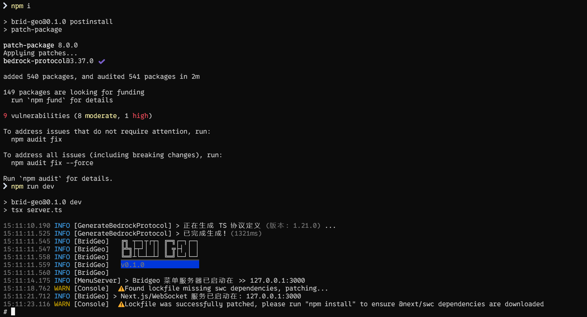
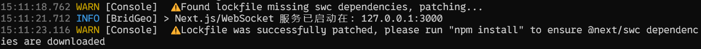
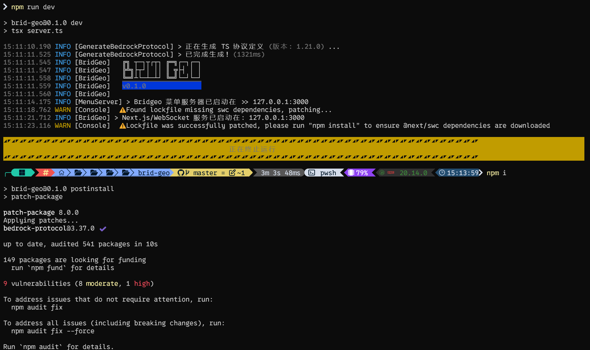
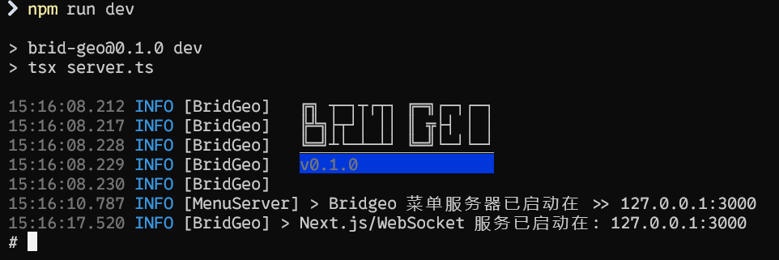

# 快速开始

> 本文档将指导你如何快速上手使用 Bridgeo(以下简称为 BGO). <br/> 注意：本文档基于 BGO 1.0.0 版本编写，如有疑问请联系作者

## 启动项目

```bash
npm i
npm run dev
```

更多内容请查看[文档](https://bridgeo.cdms.vip)

### 运行效果



### 注意事项

- 当出现
  
  的时候，根据提示请 `Ctrl + C` 退出 BGO 代理，然后运行 `npm i` 或 `npm install` 对新包进行安装，然后再次启动，秒了(如下图)
  
  

## 配置项目

BGO 项目的配置文件位于 `根目录\bridgeo.config.js`<br/>配置示例如下：

```js
/** @type {import('@/bridgeo/utils/js/bridgeo-config').BridgeoConfig} */
// 以下为可修改部分
const bridgeoConfig = {
  host: "0.0.0.0", // 要绑定的主机 (使用0.0.0.0绑定所有主机)
  port: 3000, // 要绑定到的端口 (设置为数组则表示程序只能使用这里指定的端口)
  ping: true, // 代理前先检查服务器 (是否获取服务器的motd为代理的motd, 可设置为数字以限制ping的次数)
  disposable: true, // 一次性代理 (设置为truthy(true)则表示除主代理外, 如果其他代理的玩家人数归零则会关闭当前代理)
  recursive: true, // 是否递归代理 (设置为truthy(true)则表示如果当前代理的服务器将客户端送到了其他服务器, 将递归代理其他服务器)

  version: 685, // 游戏版本 (可填写版本号, 协议版本等, 程序会自动修正)
  public: "127.0.0.1", // 服务器的对外地址 (玩家在客户端页面填写的连接地址. 不填默认127.0.0.1)
  destination: {
    // 要代理的服务器 (不填将在玩家连接到服务器时打开菜单以动态选择代理目标)
    host: "127.0.0.1", // 服务器的IP
    port: 19132, // 服务器的端口
    offline: false, // 是否使用离线支持
  },
};

export default bridgeoConfig;
```
